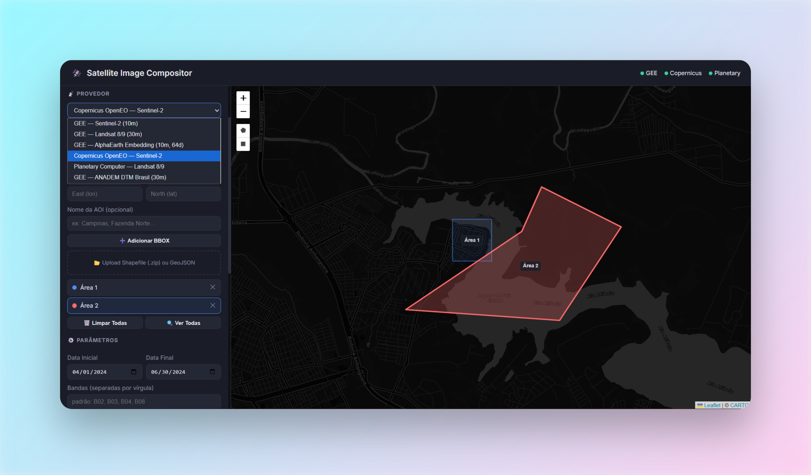

# 🛰️ Satellite Image Compositor - NoMoreClouds

WebApp local para download e composição de imagens de satélite com máscara de nuvem e mediana temporal.



| Provedor | Satélite / Produto | Resolução | Autenticação |
|----------|--------------------|-----------|--------------|
| Google Earth Engine | Sentinel-2 | 10m | Google OAuth |
| Google Earth Engine | Landsat 8/9 | 30m | Google OAuth |
| Google Earth Engine | AlphaEarth Embedding | 10m | Google OAuth |
| Copernicus OpenEO | Sentinel-2 | 10m | OIDC Device Flow |
| Planetary Computer | Landsat 8/9 | 30m | Nenhuma (público) |
| **GEE — ANADEM** | **DTM América do Sul (ANA)** | **30m** | **Google OAuth** |

---

## ⭐ Update — Novo Provedor

### 🏔️ ANADEM — Modelo Digital de Terreno (30m)

ANADEM é um DTM (Modelo Digital de **Terreno**, sem vegetação) desenvolvido pela Agência Nacional de Águas (ANA/SNIRH) para toda a América do Sul, disponível como asset público no GEE.

**Por que é útil?**
- **Corrige o bias de vegetação** do Copernicus GLO-30 (o DEM mais usado globalmente), reduzindo o erro médio de 9,6 m para 1,5 m em áreas florestadas.
- **Ideal para hidrologia** — delimitação de bacias, cálculo de declividade, análise de drenagem.
- **Cobertura total do Brasil** e da América do Sul a 30m de resolução.
- **Dataset estático** — não há dimensão temporal; as datas informadas são ignoradas.
- Publicado com licença CC BY 4.0.

> Requer login GEE. As datas informadas na interface são ignoradas (produto único, sem série temporal).

---

## 🚀 Início Rápido

### Pré-requisitos (contas)

- [Google Earth Engine](https://earthengine.google.com/) — cadastre-se e ative a API
- [Copernicus Data Space](https://dataspace.copernicus.eu/) — crie uma conta gratuita
- Planetary Computer — **sem conta necessária**
- [Git](https://git-scm.com/install/windows) - Se você ainda não baixou o git

### Clone o repositório e entre na pasta:

```
git clone https://github.com/Ga0512/NoMoreCloudsSAT.git
```

```
cd NoMoreCloudsSAT
```

### Windows

```
./setup.bat        ← instala Python, Node.js, venv e todas as dependências
./run.bat          ← inicia backend + frontend e abre o navegador
```

### Linux / Mac

```bash
chmod +x setup.sh run.sh
./setup.sh       # instala tudo
./run.sh         # inicia tudo
```

Acesse **http://localhost:3000** e pronto.

---

## 📁 Estrutura

```
satellite-webapp/
├── setup.bat / setup.sh        # Instala tudo (1 comando)
├── run.bat / run.sh            # Roda tudo (1 comando)
├── requirements.txt            # Deps Python
├── backend/
│   ├── main.py                 # FastAPI (endpoints)
│   ├── config.py               # Configurações
│   ├── models.py               # Modelos Pydantic
│   ├── jobs.py                 # Gerenciador de jobs
│   ├── utils.py                # Utilitários (AOI, clip, shapefile)
│   └── services/
│       ├── gee.py              # Google Earth Engine (Sentinel, Landsat, Embedding)
│       ├── copernicus.py       # Copernicus OpenEO
│       ├── planetary.py        # Planetary Computer
│       └── snirh.py            # ANADEM DTM Brasil (via GEE)
├── frontend/
│   ├── package.json            # Deps Node.js
│   ├── server.js               # Express (proxy + static)
│   └── public/
│       ├── index.html
│       ├── css/style.css
│       └── js/app.js
└── outputs/                    # GeoTIFFs gerados
```

---

## 🔑 Autenticação

| Provedor | Como funciona |
|----------|--------------|
| **GEE** | Clique "Login GEE" → abre navegador → autorize com Google |
| **Copernicus** | Clique "Login Copernicus" → link + código aparecem na interface → abra o link e autorize |
| **Planetary** | Automático, sempre disponível |

**Dica:** para pré-autenticar o GEE via terminal:
```bash
# Windows
venv\Scripts\activate
earthengine authenticate

# Linux/Mac
source venv/bin/activate
earthengine authenticate
```

---

## 🗺️ Como Usar

1. Faça login no provedor desejado
2. Adicione uma ou mais AOIs (desenhe no mapa, BBOX, ou upload de shapefile)
3. Configure: datas, bandas, resolução, limite de nuvens
4. Clique "🚀 Processar Todas as AOIs"
5. Acompanhe o progresso — cada AOI gera um job separado
6. Baixe os GeoTIFFs quando prontos

---

## 📡 API

| Método | Endpoint | Descrição |
|--------|----------|-----------|
| GET | `/api/health` | Health check |
| GET | `/api/auth/status` | Status de autenticação |
| POST | `/api/auth/gee` | Login GEE |
| POST | `/api/auth/copernicus` | Login Copernicus |
| POST | `/api/aoi/upload` | Upload shapefile/GeoJSON |
| POST | `/api/process` | Iniciar processamento |
| GET | `/api/jobs` | Listar jobs |
| GET | `/api/jobs/{id}` | Status de um job |
| GET | `/api/download/{file}` | Download GeoTIFF |

Documentação interativa: **http://localhost:8000/docs**

---

## ⚠️ Notas

- **Tamanho da AOI**: GEE tem limite para download direto. Mantenha < 0.5° × 0.5° para 10m.
- **Planetary Computer**: processamento é local (usa RAM). Para áreas grandes, pode demorar.
- **Copernicus OpenEO**: processamento é no servidor deles. Pode demorar, mas não usa sua máquina.
- **Clip por polígono**: o GeoTIFF sai recortado no formato exato do polígono (shapefile), não como retângulo.
- **Bandas**: cada provedor tem nomes diferentes. O padrão é RGB+NIR, mas você pode escolher qualquer combinação.
- **ANADEM**: dataset estático; as datas informadas são aceitas pela interface mas ignoradas no processamento. Cobertura restrita à América do Sul.
